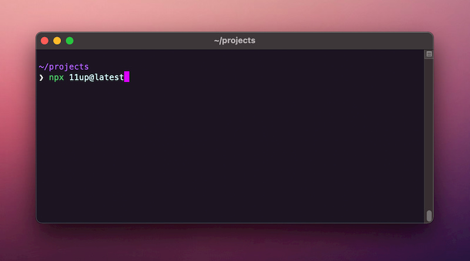
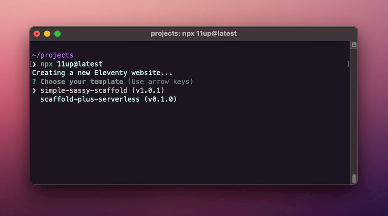
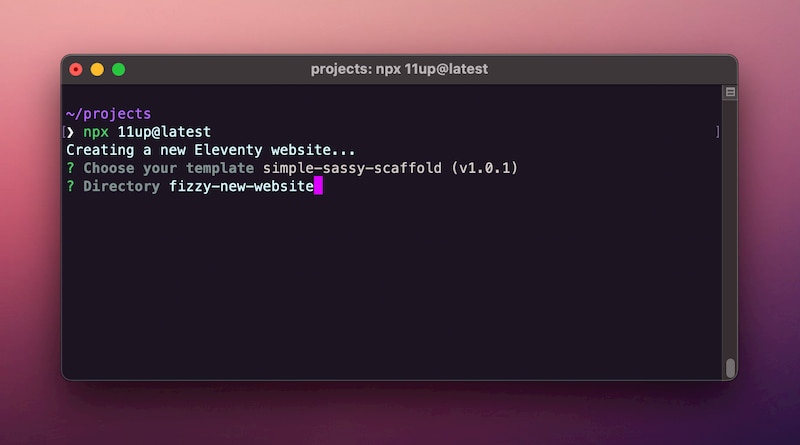
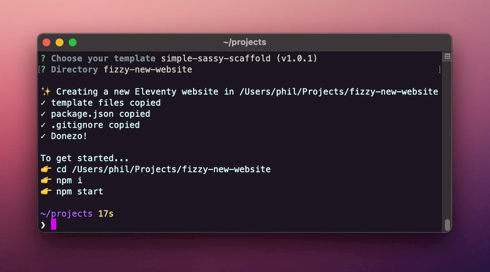

# 11up

Quickly bootstrap 11ty sites from some basic templates

## Prerequisites

- [Node and npm](https://nodejs.org)
- [Netlify CLI](https://github.com/netlify/cli)

## Usage

No need to install this package, you can create a new site structure by using `npx`.

`npx 11up`

- Choose one of the starter templates (it's a short list for now)
- Create your new site in the current directory or create a new subdirectory
- That's it

## Updating for the latest version

To ensure you always use the latest templates, you can ask npm for the latest release as you execute `npx` like this:

`npx 11up@latest`
